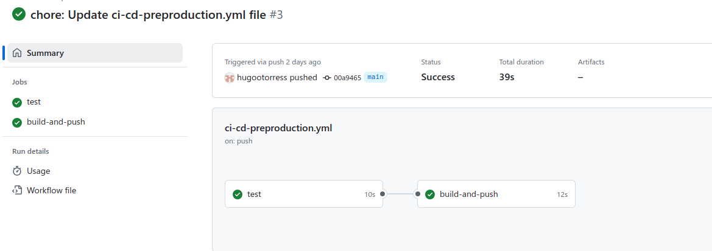

# ci-cd-flask

Este repositorio contiene los archivos necesarios para realizar una práctica de
**introducción a CI/CD** para una aplicación [Flask][1].

En esta práctica vamos a realizar las siguientes tareas.

- **Intregración Continua (CI) con GitHub Actions**. Vamos a automatizar la ejecución de
  tests unitarios cada vez que se haga un _push_ a la rama `main`.
- **Entrega Continua (CD)**. Vamos a automatizar la creación y publicación de
  una imagen Docker en Docker Hub cuando se pasen los test unitarios.
- **Despliegue Continuo (CD)**. Vamos a automatizar el despliegue de la imagen
  Docker en AWS.

## Cómo crear un virtualenv en Python

Creamos el entorno virtual.

```bash
python3 -m venv venv
```

Activamos el entorno virtual.

```bash
source venv/bin/activate
```

Instalamos las dependencias.

```bash
pip install -r requirements.txt
```

Para desactivar el entorno virtual.

```bash
deactivate
```

## Cómo ejecutar los tests

Para realizar los tests vamos a utilizar `unittest`, que es el framework de
pruebas unitarias que viene integrado en Python.

Desde la raíz del proyecto, ejecutamos el siguiente comando.

```bash
python3 -m unittest tests/*.py
```

Este comando ejecutará todos los tests que se encuentren en la carpeta `tests`.

[1]: https://flask.palletsprojects.com/en/stable/

## Creación de una Ruta Personalizada y Pruebas 

### Creación de la Ruta Personalizada en `app.py`

En nuestra aplicación Flask, podemos definir una nueva ruta personalizada de la siguiente manera:

```python
from flask import Flask

app = Flask(__name__)

@app.route("/hugo")  # Definimos la ruta personalizada
def saludopersonal():
    return "Hola amigo"

if __name__ == "__main__":
    app.run(debug=True)
```

### Creación de un Test para la Ruta
Para verificar que nuestra ruta funciona correctamente, escribimos un test :
```python
import unittest
from app import app

class TestRutas(unittest.TestCase):
    def setUp(self):
        self.app = app.test_client()
        self.app.testing = True

    def test_hugo(self):
        # Envia una solicitud GET a la ruta '/hugo'
        result = self.app.get("/hugo")  

        # Verifica que la respuesta sea "Hola amigo"
        self.assertEqual(result.status_code, 200)  
        self.assertEqual(result.data.decode(), "Hola amigo")  

if __name__ == "__main__":
    unittest.main()
```
### Creación de un Personal Access Token en DockerHub
Accede a DockerHub y genera un Personal Access Token con permisos de Read, Write y Delete (RWD).
Guárdalo en GitHub dentro de Settings > Secrets and Variables > Actions:
- DOCKER_HUB_USERNAME: Tu nombre de usuario en DockerHub.
- DOCKER_HUB_TOKEN: El token generado.

### Ejecución de Tests 
Ejecutamos los tests localmente para asegurarnos de que todo funciona:
```bash
python -m unittest test_app.py
```
Hacemos un commit y push a GitHub:
```bash
git add .
git commit -m "Añadida la ruta /hugo y sus tests"
git push origin main
```
Vamos a GitHub > Actions y verificamos que los tests se ejecuten correctamente.

### Como debe quedar
Si todo sale bien en Actions los tests deberían aparecer en verde y el proceso build-and-push debería completarse con éxito como se puede apreciar en la captura de pantalla:
